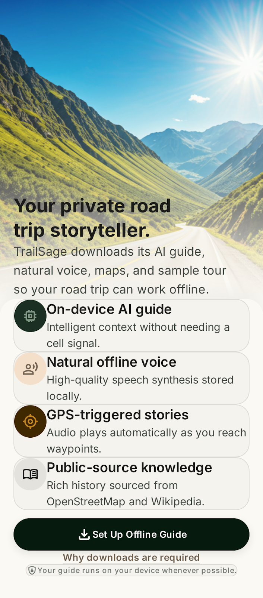
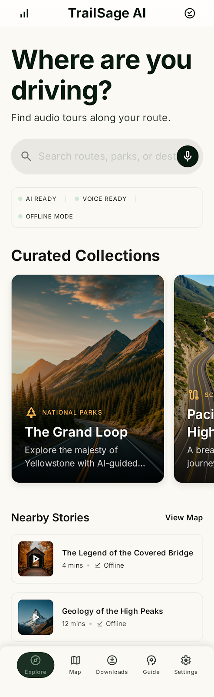
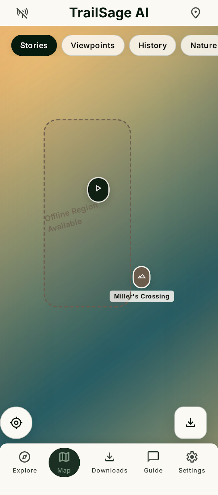
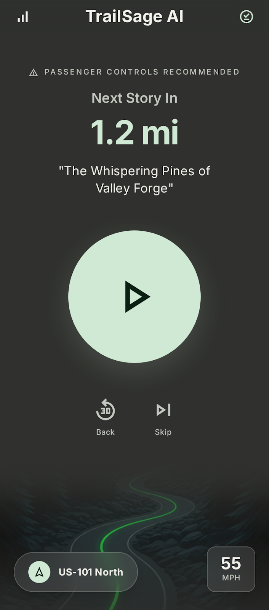
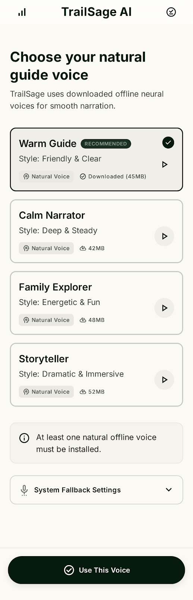
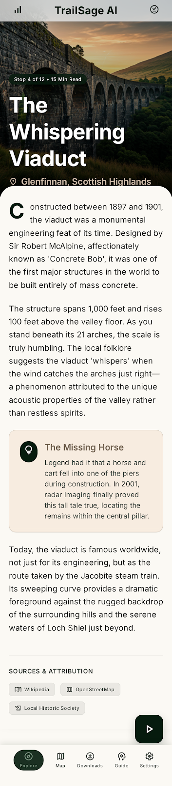

# TrailSage AI

### *Your private road trip storyteller.*

TrailSage AI is an offline-first GPS audio tour guide for Android. Designed for deep mountain valleys, long highways, and remote national parks where cellular service vanishes, TrailSage AI packages on-device Artificial Intelligence, neural narration, and detailed offline maps to tell you the stories of the land as you drive.

---

## 🌟 Key Features

*   **🧠 Local AI Storytelling:** Powered by Google Gemma 2B and on-device LiteRT. Get answers to your travel queries about landmarks, flora, and history using our localized Retrieval-Augmented Generation (RAG) system—no cloud APIs or data connections needed.
*   **🗣️ Expressive Neural Voices:** Utilizes the Sherpa-ONNX native synthesis engine and VITS voice profiles. Listen to highly expressive, natural human voice tours instead of robotic system-fallback audio.
*   **🗺️ Offline OpenStreetMap Exploration:** View paths, trails, and terrain offline using pre-packaged vector PMTiles extracts.
*   **📍 Automatic GPS Triggers:** Advanced radius and bearing calculation plays matching historical stories at the exact moment you approach landmarks from the correct direction.
*   **🔗 Anonymous Trip Sharing:** Share your custom or curated road-trip tours with friends. Generates a static preview link that opens in any browser with interactive maps, stop summaries, and directions, or imports back directly into TrailSage AI via deep links.
*   **🔒 Absolute Privacy:** No ad SDKs, no location tracking, and no external data sales. Your location and tour history stay on your device permanently.

---

## 📸 App Preview

| Welcome & Setup | Explore Dashboard | Offline Map Navigation |
| :---: | :---: | :---: |
|  |  |  |

| Driving Mode HUD | Neural Voice Selection | Detailed Story Information |
| :---: | :---: | :---: |
|  |  |  |

---

## 🚀 How to Get Started

1.  **Download the App:** Install the latest release build from our [GitHub Releases](https://github.com/chartmann1590/trailsage-ai-android/releases) section.
2.  **Get Your Tour Packs:** Download a travel pack (such as our Adirondack High Peaks Loop) to cache offline maps, route layouts, and story files.
3.  **Configure On-Device AI:** Follow the onboarding prompts to verify and load the local Gemma LLM.
4.  **Install Neural Voices:** Select and install a Piper/VITS voice pack to activate human-like narration.
5.  **Start Your Journey:** Activate your GPS, select **Start Driving**, and let TrailSage narrate your adventure!

---

## ℹ️ Technical Info

This is an open-source project written natively for Android.

*   **Platform:** Android (source target SDK 36, minimum JVM Java 21 compatible)
*   **UI Framework:** Jetpack Compose (Material 3)
*   **Speech System:** Sherpa-ONNX with Piper models
*   **Map System:** MapLibre GL with PMTiles

---

## 🛠️ Contribution & Development

Are you a developer, geographer, or writer looking to build your own tour packs or contribute to the app?

See our detailed [Developer Guide](docs/developer-guide.md) to set up your JDK 21 build system, build the debug APK, and work with the Wikimedia/OpenStreetMap python builders.

---

## 📄 License & Attribution

Distributed under the MIT License. See [LICENSE](LICENSE) and [ATTRIBUTION.md](ATTRIBUTION.md) for full details.
